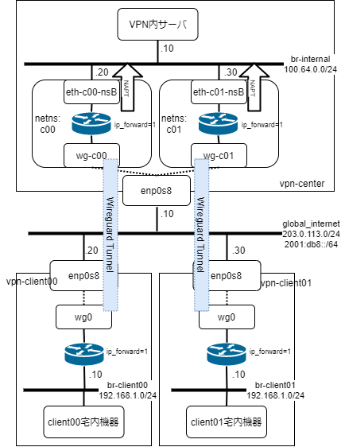

niransix-poc
====

クライアントからの wireguard 接続を別 netns 上の wg interface で受けて NAPT するサンプル





```
$ vagrant up
```

```
$ vagrant ssh vpn-center
vagrant@vpn-center:~$ sudo -i
root@vpn-center:~# tcpdump -nei enp0s8
tcpdump: verbose output suppressed, use -v or -vv for full protocol decode
listening on enp0s8, link-type EN10MB (Ethernet), capture size 262144 bytes
16:14:59.300296 08:00:27:86:53:d9 > 08:00:27:ca:ec:cc, ethertype IPv6 (0x86dd), length 190: 2001:db8::20.37031 > 2001:db8::10.50000: UDP, length 128
16:14:59.300426 08:00:27:ca:ec:cc > 08:00:27:86:53:d9, ethertype IPv6 (0x86dd), length 190: 2001:db8::10.50000 > 2001:db8::20.37031: UDP, length 128
16:14:59.740590 08:00:27:15:d9:a6 > 08:00:27:ca:ec:cc, ethertype IPv6 (0x86dd), length 190: 2001:db8::30.33135 > 2001:db8::10.50001: UDP, length 128
16:14:59.740733 08:00:27:ca:ec:cc > 08:00:27:15:d9:a6, ethertype IPv6 (0x86dd), length 190: 2001:db8::10.50001 > 2001:db8::30.33135: UDP, length 128
16:15:00.330795 08:00:27:86:53:d9 > 08:00:27:ca:ec:cc, ethertype IPv6 (0x86dd), length 190: 2001:db8::20.37031 > 2001:db8::10.50000: UDP, length 128
16:15:00.330937 08:00:27:ca:ec:cc > 08:00:27:86:53:d9, ethertype IPv6 (0x86dd), length 190: 2001:db8::10.50000 > 2001:db8::20.37031: UDP, length 128
16:15:00.773626 08:00:27:15:d9:a6 > 08:00:27:ca:ec:cc, ethertype IPv6 (0x86dd), length 190: 2001:db8::30.33135 > 2001:db8::10.50001: UDP, length 128
16:15:00.773796 08:00:27:ca:ec:cc > 08:00:27:15:d9:a6, ethertype IPv6 (0x86dd), length 190: 2001:db8::10.50001 > 2001:db8::30.33135: UDP, length 128
16:15:01.477237 08:00:27:86:53:d9 > 08:00:27:ca:ec:cc, ethertype IPv6 (0x86dd), length 190: 2001:db8::20.37031 > 2001:db8::10.50000: UDP, length 128
16:15:01.477420 08:00:27:ca:ec:cc > 08:00:27:86:53:d9, ethertype IPv6 (0x86dd), length 190: 2001:db8::10.50000 > 2001:db8::20.37031: UDP, length 128
<snip>
```

```
$ vagrant ssh vpn-center
vagrant@vpn-center:~$ sudo -i
root@vpn-center:~# tcpdump -nei br-internal
tcpdump: verbose output suppressed, use -v or -vv for full protocol decode
listening on br-internal, link-type EN10MB (Ethernet), capture size 262144 bytes
16:14:59.300369 02:5e:81:1e:60:b4 > 92:57:1d:6b:3b:d9, ethertype IPv4 (0x0800), length 98: 100.64.0.20 > 100.64.0.10: ICMP echo request, id 5, seq 1, length 64
16:14:59.300394 92:57:1d:6b:3b:d9 > 02:5e:81:1e:60:b4, ethertype IPv4 (0x0800), length 98: 100.64.0.10 > 100.64.0.20: ICMP echo reply, id 5, seq 1, length 64
16:14:59.740680 7a:2d:61:e3:3e:c0 > 92:57:1d:6b:3b:d9, ethertype IPv4 (0x0800), length 98: 100.64.0.30 > 100.64.0.10: ICMP echo request, id 5, seq 1, length 64
16:14:59.740713 92:57:1d:6b:3b:d9 > 7a:2d:61:e3:3e:c0, ethertype IPv4 (0x0800), length 98: 100.64.0.10 > 100.64.0.30: ICMP echo reply, id 5, seq 1, length 64
16:15:00.330888 02:5e:81:1e:60:b4 > 92:57:1d:6b:3b:d9, ethertype IPv4 (0x0800), length 98: 100.64.0.20 > 100.64.0.10: ICMP echo request, id 5, seq 2, length 64
16:15:00.330918 92:57:1d:6b:3b:d9 > 02:5e:81:1e:60:b4, ethertype IPv4 (0x0800), length 98: 100.64.0.10 > 100.64.0.20: ICMP echo reply, id 5, seq 2, length 64
16:15:00.773719 7a:2d:61:e3:3e:c0 > 92:57:1d:6b:3b:d9, ethertype IPv4 (0x0800), length 98: 100.64.0.30 > 100.64.0.10: ICMP echo request, id 5, seq 2, length 64
16:15:00.773744 92:57:1d:6b:3b:d9 > 7a:2d:61:e3:3e:c0, ethertype IPv4 (0x0800), length 98: 100.64.0.10 > 100.64.0.30: ICMP echo reply, id 5, seq 2, length 64
16:15:01.477335 02:5e:81:1e:60:b4 > 92:57:1d:6b:3b:d9, ethertype IPv4 (0x0800), length 98: 100.64.0.20 > 100.64.0.10: ICMP echo request, id 5, seq 3, length 64
16:15:01.477364 92:57:1d:6b:3b:d9 > 02:5e:81:1e:60:b4, ethertype IPv4 (0x0800), length 98: 100.64.0.10 > 100.64.0.20: ICMP echo reply, id 5, seq 3, length 64
<snip>
```

```
$ vagrant ssh vpn-client00
vagrant@vpn-client00:~$ ping -c10 -I 192.168.1.10 100.64.0.10
PING 100.64.0.10 (100.64.0.10) from 192.168.1.10 : 56(84) bytes of data.
64 bytes from 100.64.0.10: icmp_seq=1 ttl=63 time=0.525 ms
64 bytes from 100.64.0.10: icmp_seq=2 ttl=63 time=0.450 ms
64 bytes from 100.64.0.10: icmp_seq=3 ttl=63 time=0.406 ms
64 bytes from 100.64.0.10: icmp_seq=4 ttl=63 time=0.440 ms
64 bytes from 100.64.0.10: icmp_seq=5 ttl=63 time=0.585 ms
64 bytes from 100.64.0.10: icmp_seq=6 ttl=63 time=0.437 ms
64 bytes from 100.64.0.10: icmp_seq=7 ttl=63 time=0.626 ms
64 bytes from 100.64.0.10: icmp_seq=8 ttl=63 time=0.528 ms
64 bytes from 100.64.0.10: icmp_seq=9 ttl=63 time=0.480 ms
64 bytes from 100.64.0.10: icmp_seq=10 ttl=63 time=0.469 ms

--- 100.64.0.10 ping statistics ---
10 packets transmitted, 10 received, 0% packet loss, time 9194ms
rtt min/avg/max/mdev = 0.406/0.494/0.626/0.066 ms
```


```
$ vagrant ssh vpn-client01
vagrant@vpn-client01:~$ ping -c 10 -I 192.168.1.10 100.64.0.10
PING 100.64.0.10 (100.64.0.10) from 192.168.1.10 : 56(84) bytes of data.
64 bytes from 100.64.0.10: icmp_seq=1 ttl=63 time=0.497 ms
64 bytes from 100.64.0.10: icmp_seq=2 ttl=63 time=0.541 ms
64 bytes from 100.64.0.10: icmp_seq=3 ttl=63 time=0.657 ms
64 bytes from 100.64.0.10: icmp_seq=4 ttl=63 time=0.579 ms
64 bytes from 100.64.0.10: icmp_seq=5 ttl=63 time=0.500 ms
64 bytes from 100.64.0.10: icmp_seq=6 ttl=63 time=0.538 ms
64 bytes from 100.64.0.10: icmp_seq=7 ttl=63 time=0.511 ms
64 bytes from 100.64.0.10: icmp_seq=8 ttl=63 time=0.427 ms
64 bytes from 100.64.0.10: icmp_seq=9 ttl=63 time=0.506 ms
64 bytes from 100.64.0.10: icmp_seq=10 ttl=63 time=0.552 ms

--- 100.64.0.10 ping statistics ---
10 packets transmitted, 10 received, 0% packet loss, time 9208ms
rtt min/avg/max/mdev = 0.427/0.530/0.657/0.057 ms
```


```
## netns: c00
$ vagrant ssh vpn-center
vagrant@vpn-center:~$ sudo -i
root@vpn-center:~# ip netns exec c00 /bin/bash
root@vpn-center:~# ip -4 a s
5: eth-c00-nsB@if6: <BROADCAST,MULTICAST,UP,LOWER_UP> mtu 1500 qdisc noqueue state UP group default qlen 1000 link-netnsid 0
    inet 100.64.0.20/24 scope global eth-c00-nsB
       valid_lft forever preferred_lft forever
root@vpn-center:~# ip r s
default dev wg-c00 scope link
100.64.0.0/24 dev eth-c00-nsB proto kernel scope link src 100.64.0.20
root@vpn-center:~# conntrack -L -n
icmp     1 29 src=192.168.1.10 dst=100.64.0.10 type=8 code=0 id=1 src=100.64.0.10 dst=100.64.0.20 type=0 code=0 id=1 mark=0 use=1
conntrack v1.4.5 (conntrack-tools): 1 flow entries have been shown.
root@vpn-center:~#
```

```
## netns: c01
$ vagrant ssh vpn-center
vagrant@vpn-center:~$ sudo -i
root@vpn-center:~# ip netns exec c01 /bin/bash
root@vpn-center:~# ip -4 a s
7: eth-c01-nsB@if8: <BROADCAST,MULTICAST,UP,LOWER_UP> mtu 1500 qdisc noqueue state UP group default qlen 1000 link-netnsid 0
    inet 100.64.0.30/24 scope global eth-c01-nsB
       valid_lft forever preferred_lft forever
root@vpn-center:~# ip r s
default dev wg-c01 scope link
100.64.0.0/24 dev eth-c01-nsB proto kernel scope link src 100.64.0.30
root@vpn-center:~# conntrack -L -n
icmp     1 29 src=192.168.1.10 dst=100.64.0.10 type=8 code=0 id=1 src=100.64.0.10 dst=100.64.0.30 type=0 code=0 id=1 mark=0 use=1
conntrack v1.4.5 (conntrack-tools): 1 flow entries have been shown.
root@vpn-center:~#
```
